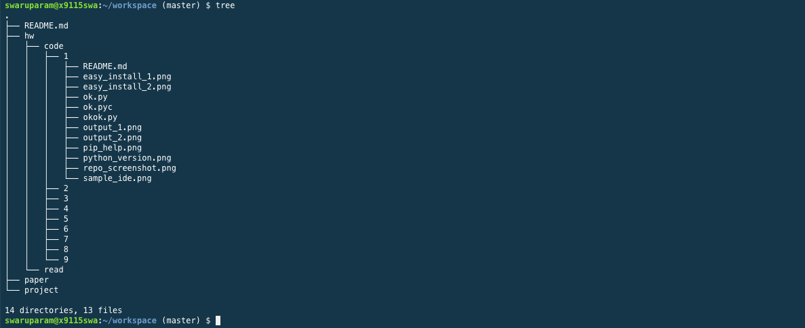

##**Code 1: coding homework**

####**Screen Snap of the top level of my Repo:**

####**Output of the commands:**

python --version:

pip help:

easy_install -h:

####**Screen shot of what it looks like to write code in my preferred Python IDE:**

####**Screenshot of output of okok.py test:**

With 4 total test cases out of which 1 fails:

With 6 total test cases out of which 2 fails:

