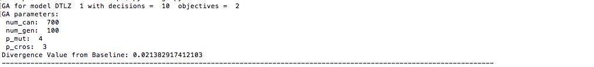

#**Code 10: Hyper parameter optimization**

#####**Swarupa Ramakrishnan (sramakr6) and Shruti Gandhi (sgandhi3)**

#####**Directions to run Code 10**

* Run 'python de.py' to obtain the results of the optimized GA configurations of DTLZ1 model candidates, by Differential Evolution

###**Abstract**

Code 8 analyzed the performance metrics of the optimizers for the DTLZ model, while Code 9 introduced Genetic Algorithms as another optimization technique to obtain the best candidates and solutions for the model. This project aims at combining the outcomes of both the previous codes, to further optimize the objectives of DTLZ1 model. The best GA configuration is provided as output by this program, which is then fed to the GA normally (without the DE optimizing over it) to verify if it does in fact result in similar objective values.

###**Overview**

The core idea of this code is described as follows. DTLZ models are at the base, with Genetic Algorithms working as optimizers over instances of the DTLZ candidates. Each instance of this Genetic Algorithm is fed as an input candidate to the top-level optimizer of Differential Evolution. Many possible configurations of GA can be developed, by mutating the parameters it takes as input, namely, the probability of crossover, probability of mutation, select method, number of candidates and number of generations. These values are chosen at random for each instance of the GA, in order to finally optimize and conclude the overall efficient objective results for the best combination of these parameters.

The simplified program flow is depicted below.

###**Introduction**

This project considers the DTLZ1 model with 10 decisions and 2 objectives. The optimizers operating on the models aim at obtaining the global minima of the objectives. Differential Evolution operates on Genetic Algorithms, which further optimizes the DTLZ1 model. The rankings of the final optimized configurations for the best objectives are produced as results, with the profiling of code to indicate total time taken.

####**Differential Evolution**

This optimizer works in an intelligent manner by generating frontiers and ruling out bad decisions by binary or continuous domination mechanisms. It assumes that the final era or frontier is the best if it is dominated by at least one but worse of none of the previous values. It additionally takes an input of probability of crossover and extrapolate amount. The former decides the probability at which the other candidates should be extrapolated and the latter defines the ratio of extrapolation. Initially, a frontier of random candidates is generated and is further entered into the iteration of repeats, to keep randomly picking any other three candidates besides itself for mutation and extrapolation, if the generated random value is within the probability of crossover. This finally yields the final frontier, which comprises of the best candidates with least objectives, in the case of minimization problem.

####**Genetic Algorithm**

Genetic Algorithm starts by initializing a population with fixed number of candidates, from that population it selects two parents by a select method e.g. binary domination, roulette wheel etc.. It then swaps the parent candidates, a process also known as crossover, followed by mutating the children generated as the result of crossover. If the generated children are fitter than the previous population candidates, it appends it to the population. To decide which candidates go into the next generation, all the candidates in the resulting population are sorted based on their scores, and any x% of best candidates are retained. We can also add a few unfit candidates to the next generation to maintain the diversity of the population. This generation is then used as a base population to select parents, and the whole process is repeated till the population converges and terminates early or till the maximum number of generations is reached.

###**Implementation**

The implementation of this project can be broken down into the following steps:

<ol>
<li> The base DTLZ1 model is coded up with 2 objectives and 10 decisions. </li>
<li> Genetic Algorithm, similar to the one implemented in Code 9, is developed to optimize the objectives of the model. From the finally obtained frontier, the distance From Hell is calculated by finding the nearest neighbor in the baseline frontier and determining the distance between these points. The mean of all these distances is used as the aggregate score of the GA for comparison basis. </li>
<li> A model for the Genetic Algorithm, which has 4 decisions (number of candidates, number of generations, crossover and mutation) is programmed to find random combinations of these four parameters. It has a single objective, which is the returned value from the GA functioning with the chosen parameters. </li>
<li> The Differential Evolution model, similar to that in Code 8, is implemented which works on the GA candidates. It generates an initial frontier of candidates, and then iterates over the number of repeats trying to mutate the parameters of configuration so as to obtain the maximum distance from Hell (farther points result in more optimized objectives). Type 1 and Type 2 comparators are used for candidate selection and early termination of DE. </li>
<li> The final output consists of the best GA configuration, with the corresponding distance value, and the final populated frontier of configurations. This is ranked based on the distance metric. </li>
<li> The best configuration that has been achieved is fed as input to Code 9, simple GA optimizer of DTLZ1, to find the resulting mean distance. This is compared to the achieved best distance of this program. </li>
</ol>

###**Results**

The following snapshots show the best candidates and their corresponding objectives (mean distance from Hell) on optimizing GA for DTLZ1 with DE.

On running for 100 candidates, with parameter options of
mutation_options = [4,5,6]
crossover_options = [1,2,3]
candidates_options = [75,100,125]
generations_options = [75,100,125]  
    

On running for 10 candidates, with parameter options of
mutation_options = [4,5,6]
crossover_options = [1,2,3]
candidates_options = [300,500,700]
generations_options = [75,100,125]

The profile of the total time taken for each function call is shown below.

Upon successful completion, the final populated frontier of optimized GA configurations is sorted based on the mean distance between the final era candidates and their nearest neighbor on the initial baseline population. 

The resulted best configuration is fed as an input to the simple GA of code 9 and the resulting distance is recorded. The obtained divergence values vary by a margin, since the baseline populations for these candidates are not the same and the random seed isn't constant.

###**Threats to Validity**

There are a number of threats to validity in this concerned project.

* While comparing the obtained best configuration with the simple GA program of code 9 to check for similar results, the initial baseline population and the random seed are not the same. This leads to a difference between the two values.

* The configurations of GA are compared on the basis of the mean of the distances from Hell, or the initial population. This is maximized in this program so that to achieve the most optimized configuration. However, since this model involves multi-objective functions, combining the objectives into a single point may reduce the level of accuracy. Comparisons based on this may not have yielded the best possible results.

###**Future Work**

Based on the threats of validity and shortcomings of this project, this analysis can be extended to include more precise operations and results in the future. Some of them are listed below.

* This current program takes more than a couple of hours for execution. Future work can be done on choosing better engineering decisions and designs to reduce the execution time, thus extending the project for increased inputs.

* The divergence value can be better optimized by usage of NSGA II, SPEA and GALE, so as to better analyze the performance of GA.
