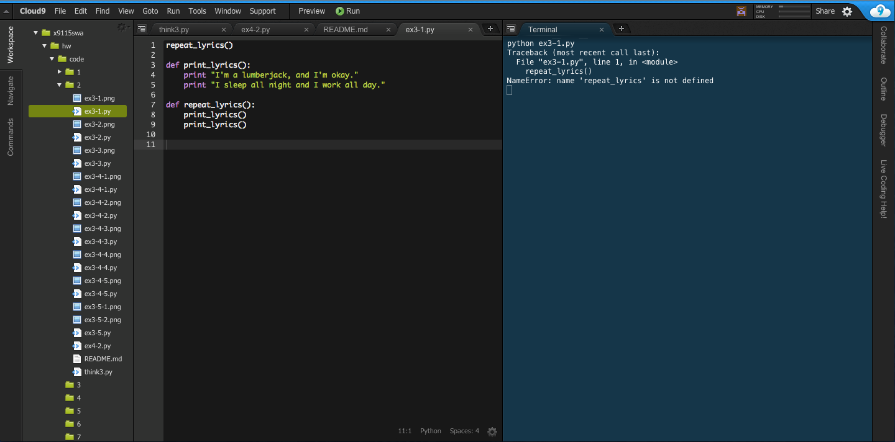
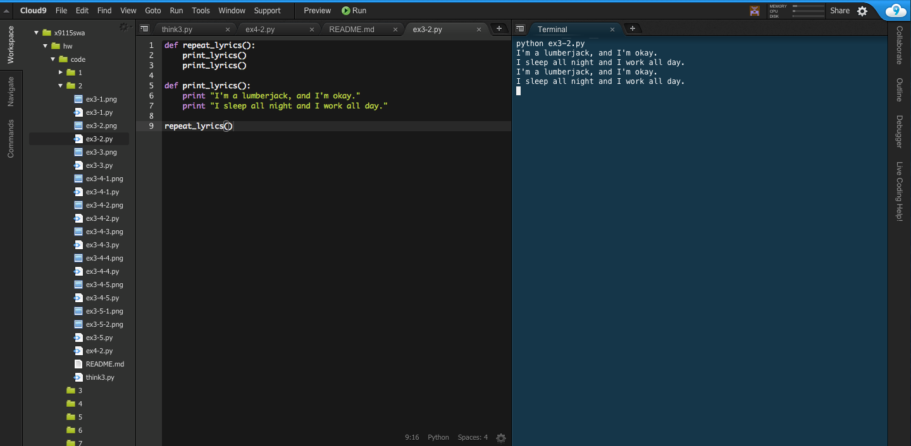
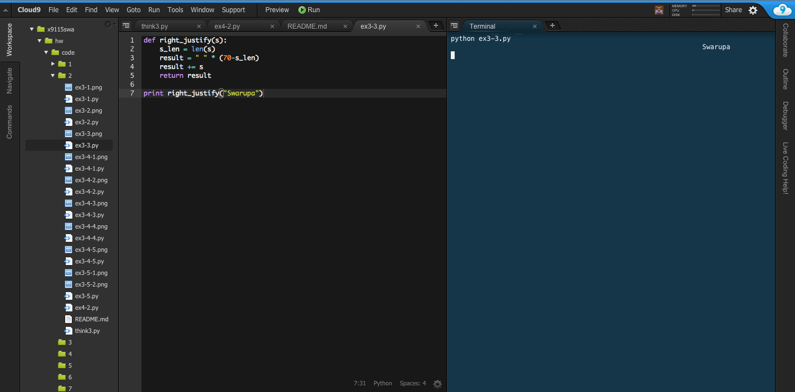
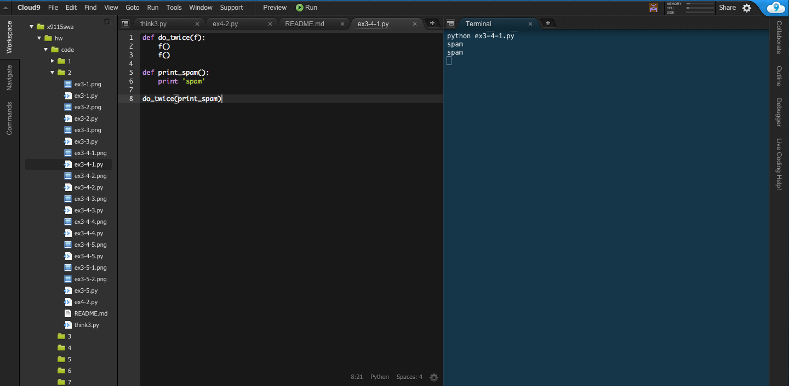

##**Code 2: coding homework**

####**Exercise 3.1**

####**Exercise 3.2**

####**Exercise 3.3**

####**Exercise 3.4**

Testing given script:

Modifying do_twice so that it takes two arguments, a function object and a value, and calls the function twice, passing the value as an argument:

Writing a more general version of print_spam, called print_twice, that takes a string as a parameter and prints it twice:

Using the modified version of do_twice to call print_twice twice, passing 'spam' as an argument:

Defining a new function called do_four that takes a function object and a value and calls the function four times, passing the value as a parameter:

####**Exercise 3.5**

Grid with three rows and three columns:

Grid with four rows and four columns:

