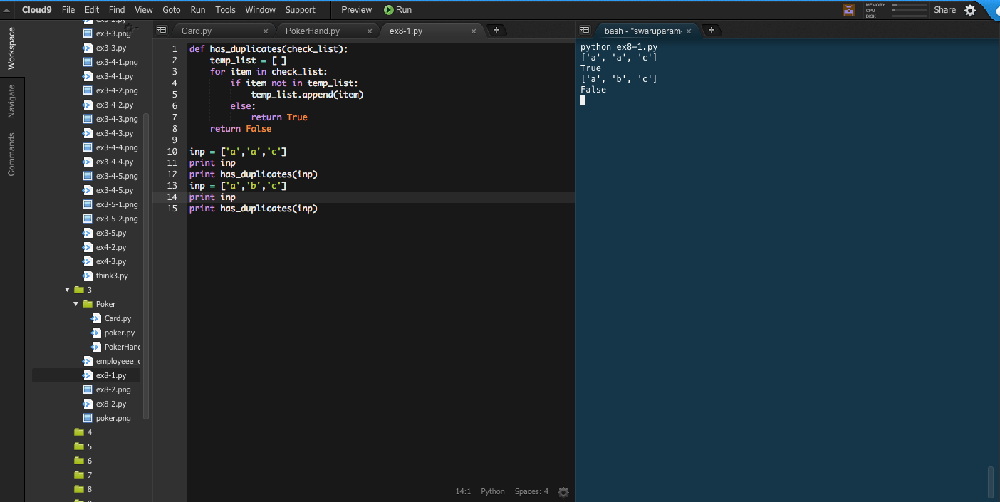
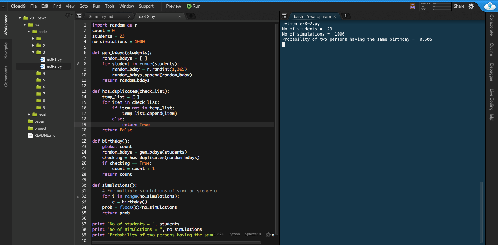
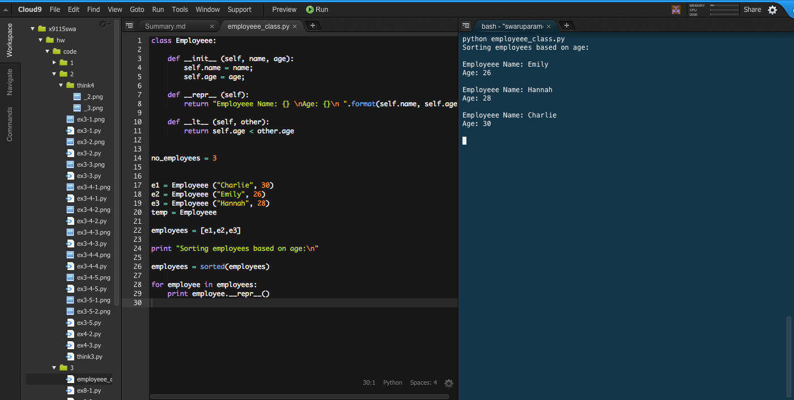
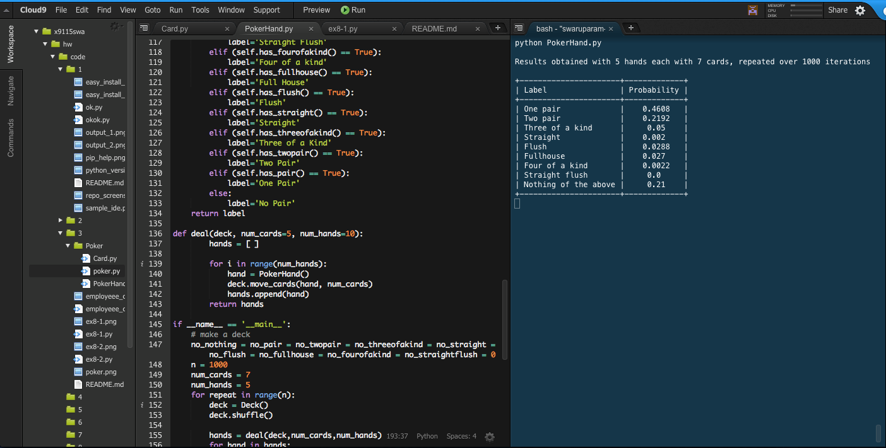

##**Code 3: coding homework**

####**Exercise 8 (Birthday Paradox):**

#####**Exercise 8.1:**

Output of /code/3/ex8-1.py:

#####**Exercise 8.2:**

Output of /code/3/ex8-2.py:

####**Employee Class:**

Output of /code/3/employeee_class.py:

####**Poker:**

Output of /code/3/Poker/PokerHand.py:

