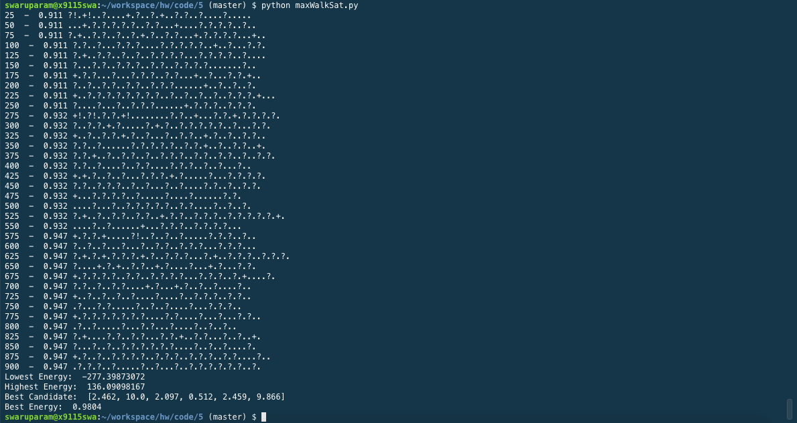

##**Code 5: coding homework**

####**Max Walk Sat:**

**Set Parameters:**

Model: Osyczka2  
Minimum Decision values = [0, 0, 1, 0, 1, 0]  
Maximum Decision values = [10, 10, 5, 6, 5, 10]  
max_tries = 100  
max_changes = 50  
threshold = 0.98  
p = 0.5  
steps (when mutating to obtain best energy) = 1000  

**Output of /code/5/maxWalkSat.py:**

