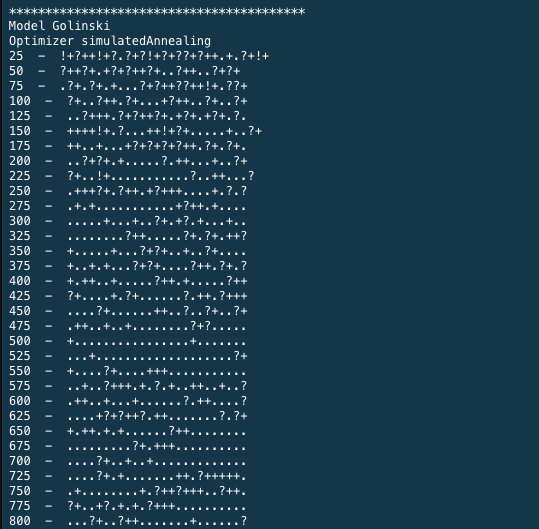
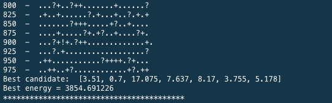
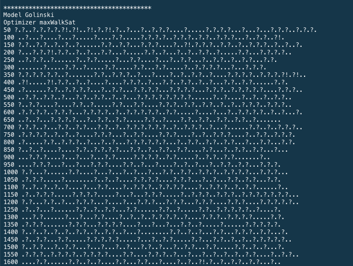
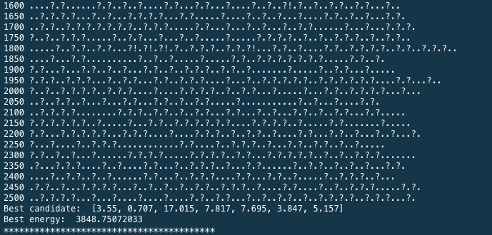
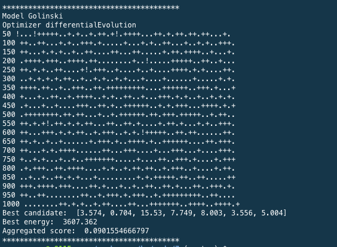
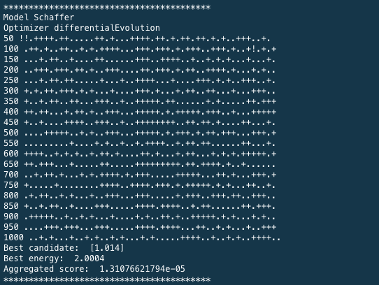
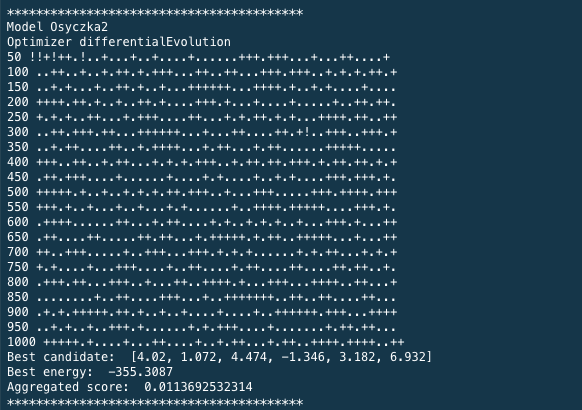
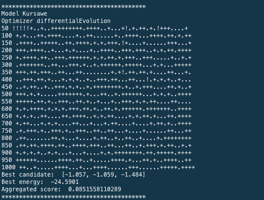

##**Code 7: coding homework**

###**Differential Evolution:**

**Models Used:**
* Schaffer
* Osyczka2 
* Kursawe
* Golinski

**Optimizers Used:**
* Simulated Annealing
* Max Walk Sat
* Differential Evolution

###**Output of /code/7/main.py:**

####**Different optimizers on Golinski**

####**Simulated Annealing on Golinski**

####**Max Walk Sat on Golinksi**

####**Differential Evolution on Golinksi**

####**Differential Evolution on different models**

####**Differential Evolution on Schaffer**

####**Differential Evolution on Osyczka2**

####**Differential Evolution on Kursawe**

