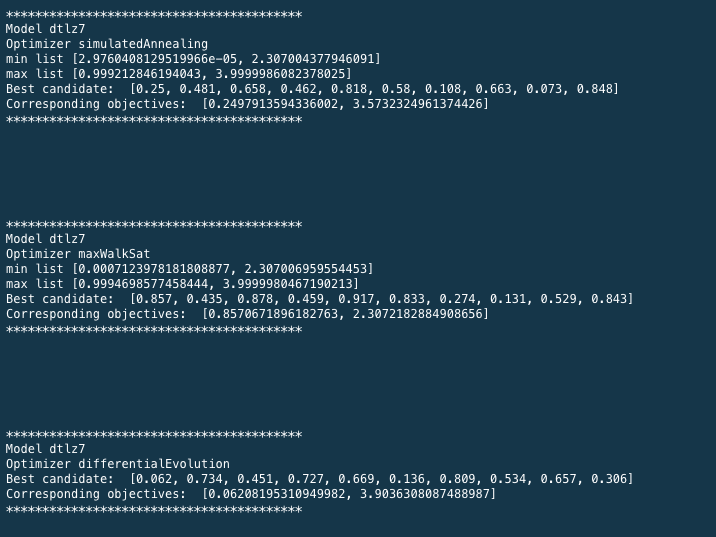
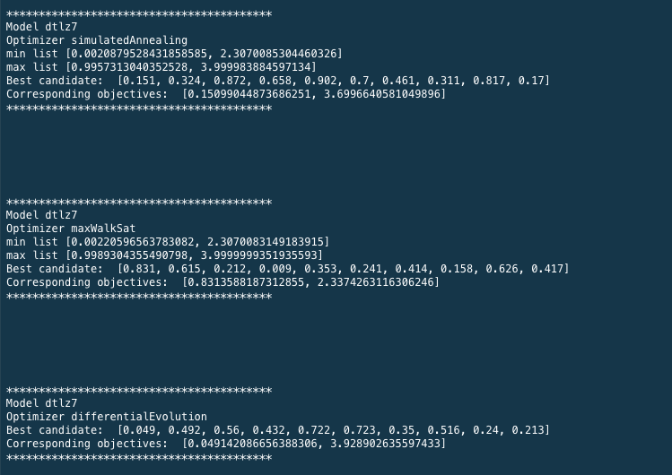
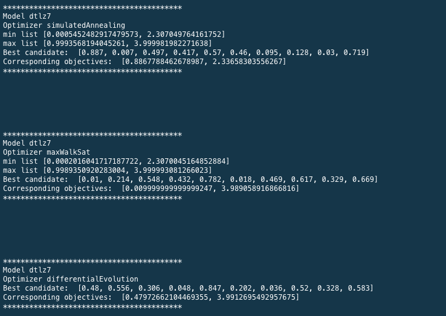
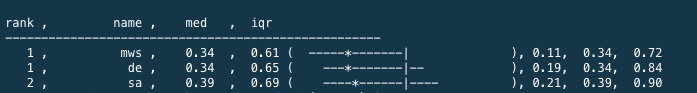
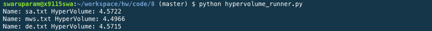

#**Code 8: Ranking of optimizers for DTLZ7 with 2 objectives and 10 decisions**
**Swarupa Ramakrishnan (sramakr6) and Shruthi Gandhi (sgandhi3)**

###**Abstract**

Each model, when run with different optimizers, yields varied objectives and decisions. To identify the best optimizer, for which the model is being reduced or expanded to the target minimum or maximum, can be found by comparing the results of all the possible combinations. This coding project works with the DTLZ7 model, on which Simulated Annealing, Max Walk Sat and Differential Evolution are performed. These results are compared based on the type comparators to provide a ranked output of the optimizers for this particular model.

###**Introduction**

This project considers the DTLZ7 model with 10 decisions and 2 objectives. The optimizers operating on the models aim at obtaining the global minima of the objectives. Three optimizers, namely, Simulated Annealing, Max Walk Sat and Differential Evolution are ranked based on the results they obtain for this chosen model.

####**Simulated Annealing**

This optimizer avoids the settling of the model objective values at local minima by jumping to suboptimal points while the temperature is still low. The number of iterations is initially fixated and the temperature is set at zero and increased every iteration. An initial model object instance is created which is considered as the best candidate with best objectives. For each iteration, the model is newly instantiated. The objectives of the generated candidate is compared with the best, and if proven better, updates the best to hold the values of itself. A random value is generated and checked if it is greater than the probability function, which determines if the candidate should remain where it is or take a risk of jumping to a worse solution. The function takes the parameters of the old and new objective values of candidates and the temperature. The old value is copied to the new value if the probability function returns true, or else, remains at the new candidate. This repeats for all iterations or until it has lives remaining. The number of lives to be added or subtracted, and the candidate comparisons are performed by type 1 comparisons, which are described later in detail.

####**Max Walk Sat**

Max Walk Sat is a non-parametric stochastic algorithm, which deals with analyzing the landscape of the data. Similar to Simulated Annealing, it prevents local minima by making jumps to random worse points. If the spread of the data is bumpy, this optimizer works most efficiently. It starts off by setting a maximum number of tries and changes, defining the number of iterations for which the optimizers runs (without early termination). Creation of object instance and shuffling it with the best instance to finally store the best energy seen so far occurs similar to SA. In addition to this, a probability is set and is checked if the generated random value is lesser. If so, the optimizer is still at it's early stages and can afford to jump to worse points to escape local minima. Thus, a decision is picked at random and changed. Else, the random decision is changed to obtain the best energy. The optimizer provides an output of the best combination of decisions and objectives.

####**Differential Evolution**

This optimizer works in an intelligent manner by generating frontiers and ruling out bad decisions by binary or continuous domination mechanisms. It assumes that the final era or frontier is the best if it is dominated by at least one but worse of none of the previous values. It additionally takes an input of probability of crossover and extrapolate amount. The former decides the probability at which the other candidates should be extrapolated and the latter defines the ratio of extrapolation. Initially, a frontier of random candidates is generated and is further entered into the iteration of repeats, to keep randomly picking any other three candidates besides itself for mutation and extrapolation, if the generated random value is within the probability of crossover. This finally yields the final frontier, which comprises of the best candidates with least objectives, in the case of minimization problem.

###**Implementation**

The project is divided mainly into 5 parts:
* Coding up the optimizers (Simulated Annealing, Max Walk Sat and Differential Evolution)
* Coding up the model (DTLZ7)
* Running the model for each optimizer and store final frontiers
* Rank the optimizers based on the loss encountered
* Obtaining the hyper volumes of the different runs on the model

Optimizers and the model were coded up based on their specifications as described. In order to compare the candidates to determine which is better (Type 1 comparison), BDOM has been used. BDOM determines the better candidate by comparing the objective scores of the candidates. If either of the objective is lesser than any other objective of the other candidate, then the current one is said to be dominated and is returned. Else, the other candidate is preserved. It is extremely fast mechanism since it is performed multiple times throughout a program. These comparisons are used for updating the best candidates for each iteration.

If the improvement between consecutive eras are observed to have reduced to less than 1%, it does not make sense for the iterations to still work on the data for each optimizer. In this case, the optimizer can be early terminated. Two consecutive candidate eras are compared (Type 2 comparison) for at least 1% improvement in the mean of loss from baseline population. If so, the methodology proceeds with an extra 5 lives. Else, it is said to be converging and thus, lives are reduced by 1. It is ensured that the comparison isn't that slow, so that it doesn't become a bottleneck for comparisons between iterations.

Each optimizer runs on the model for 20 iterations, collecting all the objectives for the candidates, to improve the accuracy of results obtained.

Once the final frontiers of the optimizers are obtained, 2 objectives of the candidates are reduced to a single value, equal to the root mean square distance from the nearest neighbor of the baseline population. This is formatted and sent as an argument to the rdivDemo function of sk.py to rank the optimizers based on the Euclidean distance measure. (Type 3 comparisons)

The hyper volumes of the different optimizers are obtained by saving the final frontiers as text files and calling the hypervolume_runner.py. It provides an output of the hyper volumes of different optimizers working on the same model.

###**Results**

The following snapshots show the best candidates and their corresponding objectives for 3 runs (out of a total of 20 runs) of each optimizer on DTLZ7, with 2 objectives and 10 decisions.

Upon successful completion of 20 iterations of each optimizer on the model, they are ranked on basis of the mean distance between the final era candidates and their nearest neighbor on the initial baseline population. The statistical machinery Scott-Knott technique is applied for ranking the optimizers. The median and interquartile ranges are provided for each optimizer, marking the difference between them.

Hyper volumes of the optimizers are calculated and their results are as shown below.

###**Threads to Validity**

###**Future Work**

###**References**
<ol>
<li>
https://github.com/txt/mase/blob/master/src/doc/sk.py
</li>
<li>
https://github.com/ai-se/Spread-HyperVolume
</li>
</ol>

