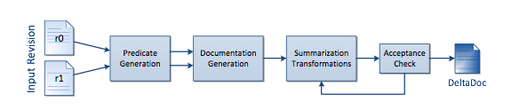

##**Reading Assignment 2: Summary**

####**i. Reference**

**Raymond P.L. Buse and Westley Weimer. The University of Virginia. ASE 2010. Automatically Documenting Program Changes.**

**Link to the paper: ** [Paper] ( https://github.com/swaruparam/x9115swa/blob/master/hw/read/2/Automatically%20Documenting%20Program%20Changes.pdf )

####**ii. Keywords**

**ii1. Commit Messages** 
Commit messages or log messages are key components of software maintenance. They are descriptive content, clarifying the purpose of code revision or providing information about the bugs present. In the field of software development, it is important for such messages to accompany changes in code, so as to enable easy referencing of the changes and program flow in future.

**ii2. Differencing**
This phenomenon states the exact lines of program code, which have been changed from the previous version. There are multiple tools that point to these blocks of code, so as to efficiently let the developer compare the alterations.

**ii3. Code Summarization**
Code summarization refers to the documentation of the program, explaining the changes made if any. Modification in code, future changes that needs to accounted, present bugs, test cases that need to be included, etc are the information which are provided by code summarization. 

**ii4. Path Predicates**
These are formulae, which indicate the path of program flow, i.e., the statements which would be executed in a particular case or condition. In order to obtain efficient code documentation, it is necessary to iterate through all loop-free path predicates in a program and document the steps taken for all cases exhaustively.

####**iii. Brief Notes**

**iii1. Motivational Statements**
Software developers deal with a lot of code repositories and multiple revisions of the program, adding detail or increasing the efficiency with each modification. Such changes must be properly documented in order to provide clarity in future when the code is referenced back. When multiple people are working on a common module, it becomes even more important for the modifications to be clearly mentioned with respect to 'What?' and 'Why?' the lines of code have been written the particular way. While multiple tools like log messages and diff do show the code changes that have been made, they do not provide enough contextual information on the 'What?'. Even when developers do enter their commit messages, they often do not exceed more than a line of description for an entire block of code change. This has motivated the authors to come up with a model that would take in two versions of the code as input and would return a document which provides information on code changes with respect to each method separately.

**iii2. New Results**

The proposed model, called the DeltaDoc, given an output in the format of 'When calling A(), If X, do Y Instead of Z.' for each altered method. The conditional statements, exceptional statements and return values are monitored in the input code files to derive such an output. Newly created methods or deleted ones are mentioned as statements in the document. This output is more descriptive than the log messages and is fewer in lines and more easily readable when compared to the diff results. Based on human study, it has been found out that the generated documentation is suitable for replacing 89% of the log messages that describe code changes.

The high-level view of the architecture of DeltaDoc is as shown in the figure below. With the input code revisions, path predicates are generated and are used to generate the extensive documentation. The size of this resulted document is reduced by means of repeated summarization and transformation, till it is ready to be accepted.

**iii3. Study Instruments**

Human study was the main study instrument that was incorporated to obtain the qualitative analysis for this DeltaDoc model. In 63% of cases the annotators either had no preference (17%) or preferred the DeltaDoc (46%). Many participants noted that the strength of the algorithm output is that it is “more specific” when compared to human-written log messages, but simultaneously “not as low level with no context” as compared to diff output. 15 of the 16 participants agreed that the algorithm would provide a useful supplement to log messages. The general consensus was that “having both is ideal,” suggesting that DeltaDoc can serve as a useful supplement to human documentation when both are available.

**iii4. Related Work**

<ul>
<li> M. Kim and D. Notkin. Discovering and representing systematic code changes. In International Conference on Software Engineering, pages 309–319, 2009.  - Discovers and documents high-level structure in code changes. </li> 

<li> K. J. Hoffman, P. Eugster, and S. Jagannathan. Semantics-aware trace analysis. SIGPLAN Not., 44(6):453–464, 2009. - Determines the difference between program versions, focusing analysis focus program paths. In contrast to DeltaDoc, their tool is dynamic and its primary application is regression testing instead of documentation. </li> 

<li> S. Comai, S. Marrara, and L. Tanca. XML document summarization: Using XQuery for synopsis creation. In Database and Expert Systems Applications, pages 928–932, 2004. - Produces structured output to increase the speed of queries of the summarized data.  </li>

</ul>

####**iv. Suggested Improvements**

<ul>
<li> Benchmarks taken into consideration in the authors' model are not always accurate, in the sense that the revisions considered as input may not be indictive. To obtain better results, providing contiguous code versions to the model can ensure this. </li>

<li> The existing model only focuses on documenting the 'What?' aspect of code modifications. By completely removing the 'Why?' information, much subjective and context-dependent messages are lost. Improvements can account for these messages as well. </li>

</ul>

