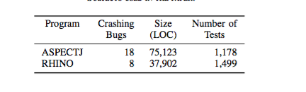
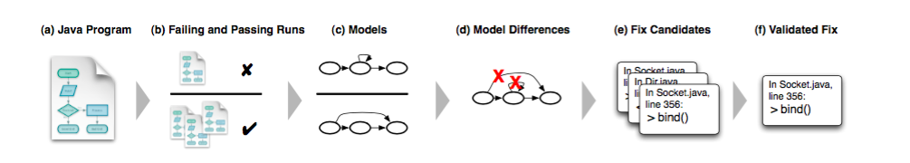

##**Reading Assignment 4: Summary**

####**i. Reference**

**Valentin Dallmeier, Andreas Zeller, Bertrand Meyer. ASE 2009. Generating Fixes from Object Behavior Anomalies**

**Link to the paper: ** [Paper] ( https://github.com/swaruparam/x9115swa/blob/master/hw/read/4/Generating%20Fixes%20from%20Object%20Behavior%20Anomalies.pdf )

####**ii. Keywords**

**ii1. PACHIKA tool** 
PACHIKA tool is the model developed by the authors of the paper, which aims at automatically correcting bugs, in addition to mere detection. It monitors successful and failing program executions, compares them to obtain the model differences that cause the bug and come up with candidate fix solutions.

**ii2. ASPECTJ and RHINO**
These are programs, which are used as the subjects in order to test the proposed model upon. They have crashing bugs which are known before-hand and the working of PICHIKA is determined by the number of bugs its able to resolve. 

**ii3. Object Behavior Models**
These are models that characterize the behavior of a program as finite state machines over object states and method calls. They are extracted by tracing the program execution and logging the states of the program at different periods of time.

**ii4. Fix Candidates/Validated Fix**
Once the model differences have been analyzed and the cause of bug is determined, plugin code snippets to rectify this are developed by the model automatically. These are referred to as fix candidates. However, among the many fix candidates, only a few would result in the failed run to pass. These are termed as validated fixes. 

####**iii. Brief Notes**

**iii1. Motivational Statements**

It is now easily possible to locate bugs within a program, but still remains a challenge to rectify these detected bugs. If the fixing is automated as well, the entire bug detection and correction can be handled by a model, un-intervened by human. This improves the efficiency by a great deal and saves time for the user to manually reset the bugs. The authors of the paper have proposed the new model, PACHIKA, which aims at rectifying the detected errors by generating candidate fix solutions and later, testing all these to obtain the final validated fix. 

**iii2. Study Instruments**

To study and test the proposed model, two program subjects are used, namely the ASPECTJ and RHINO. These have listed crashing bugs, along with the size and number of tests within each program. 

PACHIKA tool is tested for accuracy by checking the number of bugs it is able to fix with respect to the total number of bugs present. Further, it is also used to test the number of validated fixes that are generated in order to correct the failing run and make it pass at all executions.

The sequence of operations, which are carried out on each program, is shown in the figure below. 

The program is executed multiple times to categorize the failing and passing runs. It is then interpreted as a object behavior model and differences are evaluated between them. Based on this, fix candidates are generated that rectify the failing cases, from which the test case that converts the fail run to pass is termed as the validated fix solution. 

**iii3. New Results**

On ASPECTJ, PICHIKA generates fix candidates for 14 out of 18 bugs and for 6 bugs, the tool finds at least one validated fix. On the other hand, for RHINO, it generates fix candidates for 3 out of 8 bugs and no validated fix. The reasons for this can be that RHINO is relatively much smaller than ASPECTJ, with lesser number of classes of complex models, thereby reducing the probability of finding a violation. It is also possible that PICHIKA may have faced technical restrictions such as limitation of methods it can traverse through due to reduced number of parameters.

**iii4. Related Work**

<ul>
<li> J. A. Jones and M. J. Harrold. Empirical evaluation of the Tarantula automatic fault-localization technique. In ASE ’05, pages 273–282, 2005. - Deals with the problem of bug localization, thereby lifting focus of developer to concentrate on less trivial parts of the program. </li> 

<li> W. Weimer, T. Nguyen, C. L. Goues, and S. Forrest. Automatically finding patches using genetic programming. In ICSE ’09, Vancouver, Canada, May 2009. - Uses adaptive random search to mechanically mutate a failing C program, instead of relying on behavioral differences between passing and failing runs like PICHIKA.  </li> 

<li> I. Ciupa, A. Leitner, M. Oriol, and B. Meyer. Experimental assessment of random testing for object-oriented software. In ISSTA ’07, pages 84–94, New York, NY, USA, 2007. ACM. - Generate random sequences of method calls using existing contracts to retain the valid sequences.  </li>

</ul>

####**iv. Suggested Improvements**

<ul>
<li> Adaptive Fix Generation. Since a large set of possible fixes is available, the generation of candidate fixes can be improvised such that further mutations for bug fixing can be based from the previous occurrences. </li>

<li> Assessing the impact of fixes. In the case where multiple test cases are potential validate fixes, there must be a mechanism to limit the number of testing and an algorithm to select the solution with the greatest score or metric. </li>

<li> Leveraging contracts. It is important that before a method is called, it is determined that all preconditions are satisfied. This can be made simpler by inferring the necessary assertions by means of a language for easy filtration, instead of interpreting it from the model.</li>

</ul>

