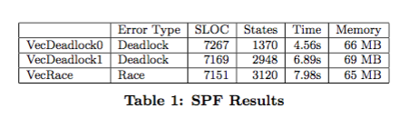

##**Reading Assignment 4: Summary**

####**i. Reference**

**Corina S. Pasareanu and Neha Rungta. ASE 2010. Symbolic PathFinder: Symbolic Execution of Java Bytecode**

**Link to the paper: ** [Paper] ( https://github.com/swaruparam/x9115swa/blob/master/hw/read/4/Symbolic%20PathFinder%20Symbolic%20Execution%20of%20Java%20Bytecode.pdf )

####**ii. Keywords**

**ii1. Symbolic execution** 
Symbolic execution refers to the phenomenon by which program codes are interpreted using symbolic measures, instead of concrete measures, to obtain desired outputs. The input variables and expressions are solved using the symbolic representation of values and the computations are performed.

**ii2. Symbolic PathFinder (SPF)**
SPF is an automated tool for performing the symbolic execution of Java byte code. It works on various input data types and carries out operations between these variables with polymorphic class hierarchy. SPF handles programs with parallelism enabled, as well as a combination of concrete and symbolic execution platforms.

**ii3. Automated Test Case Generation**
Programs require efficient and extensive testing in order to ensure the stability and durability of designed code. Using SPF, one can generate automated test cases, which would account for all the possible scenarios that may arise during program execution. This is done through structural analysis of program flow and symbolic executions.

**ii4. Program Analysis**
Programs can be analyzed in multiple ways, before being developed into an error-free and fault-free code. This analysis involves multiple and repeated steps of development and testing.  

####**iii. Brief Notes**

**iii1. Motivational Statements**

Certain Java programs may have unspecified inputs, thereby creating an absence of concrete values that can be used for testing purposes. Instead, the Java byte code can be operated on using symbolic executions, replacing the expressions with equivalent symbolic code and deducing the required outputs and results. This would then yield to the possibility of generating automatic test cases for the program, without mentioning any standard inputs. SPF is a tool, which is capable of performing this interpretation and test case generation for the required code logic. This is successfully used in NASA, Academia and industry to detect faulty bugs in code and also ease the operation of clean code development.

**iii2. New Results**

Using SPF, the error types of Race conditions or Deadlocks are detected with the usage of minimum resources, as listed in the table below. The time taken to analyze the given program, with symbolic executions and automatic test case generations is minimal and thus, is shown to be very efficient. 

Various Java class libraries are operated upon using SPF, in a systematic procedure of multiple operations. The program is tested for instructions, branching conditions, decision constraints, input data structures, etc., to analyze the different aspects of the program and deduce the final report.

**iii3. Study Instruments**

To depict the efficiency of the tool, it is combined with the Java PathFinder verification tool-set where the JPF-core is replaced by the SPF to employ symbolic instead of concrete executions. User specifies a depth to which the program is to be analyzed so as to make sure that the tool does not endlessly execute the symbolic code. The tool is run on multiple Java classes to test if the subtle bugs are uncovered. 

**iii4. Related Work**

<ul>
<li> X. Deng, J. Lee, and Robby. Bogor/Kiasan: a k-bounded symbolic execution for checking strong heap properties of open systems. In ASE, 2006. - Does not separate between concrete and symbolic data and cannot handle complex Math constraints. </li> 

<li> S. Anand, C. Pa ̆sa ̆reanu, and W. Visser. JPF–SE: A Symbolic Execution Extension to Java PathFinder. TACAS, pages 134–138, 2007. - Requires a program instrumentation or a type-based analysis, and hence is less efficient. </li> 

<li> K. Sen, D. Marinov, and G. Agha. CUTE: a concolic unit testing engine for C. In Proc. ESEC/FSE-13, pages 263–272, New York, NY, USA, 2005. ACM. - Work by program instrumentation and does not cope with multithreading.  </li>

</ul>

####**iv. Suggested Improvements**

<ul>
<li> Though SPF tool analyzes the code optimally, it is not scalable in the sense that it does not operate on extended number of constraints. This could be worked upon to cater to the needs of large complicated programs as well. </li>

<li> SPF could be made to run in parallel, to increase the speed of operation to a much larger extent. The overall code can be segmented into multiple blocks of code and be processed simultaneously. </li>

</ul>
