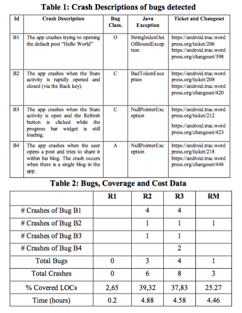

##**Reading Assignment 5: Summary**

####**i. Reference**

**Domenico Amalfitano, Anna Rita Fasolino, Porfirio Tramontana, Salvatore De Carmine and Atif M. Memon. ASE 2012. Using GUI Ripping for Automated Testing of Android Applications**

**Link to the paper: ** [Paper] ( https://github.com/swaruparam/x9115swa/blob/master/hw/read/3/Using%20GUI%20Ripping%20for%20Automated%20Testing%20of%20Android%20Applications.pdf )

####**ii. Keywords**

**ii1. Android** 
Android is the Operating Systems used in many mobile devices and is used to deploy apps in a easy and exhaustive manner. It follows the base programming language of Java but has extended libraries and capabilities to support the requirements of mobile device applications.

**ii2. GUI**
GUI or Graphic User Interface refers to how an application is seen by the end users. It represents the mechanism by which one would be able to access through the menus and options of the application in order to set up a desired task. It is usually designed in an easily comprehensible manner so as to enable ease of operation and flexibiliy of approach.

**ii3. Automation**
Automation is the phenomenon of inducing scripts to the framework in order to observe complete operation of tasks without the support of external inputs. It is highly favourable in multiple situations as it tends to get work done much faster and throughly, even when users carelessly skip to deploy a specific set of tasks. 

**ii4. Testing tools**
Testing tools can be snippets of programs or other test cases which are employed within a framework to test the complete functionalty of it. There may be multiple edge cases which may not be catered to by a model, since the most frequently case would be coded up as the base case. To test the working of the model under these adverse scenarios, testing tools are employed.

####**iii. Brief Notes**

**iii1. Motivational Statements**

At the rate of the creation of Android apps today, there are increasing number of applications amidst these which have undocumented bugs and errors which aren't always picked up by the traditional compilers and IDE. Since these apps follow a structured approach, many underlying errors are commonly looked past during the deployment. Additionally, though the programming language is predominantly Java, it is seen that many apps are developed without exercising the right usage of 'Activity' component lifecycle, an additional plugin of Android not supported by Java. In the cases of multithreading operations, multiple execution and rigorous testing can only raise the code faults. To cater to these needs, the authors of the paper propagate an automated testing tool, AndroidRipper, which does a through structured check on the developed app using the GUI, pointing out faults which aren't previously documented or detected.

**iii2. Hypotheses**

AndroidRipper would prevent applications from being developed with faulty errors in the underlying code and make the framework stable even in cases of odd edge cases. The program flow structure is observed en-to-end using this model by observing the application’s GUI and exploits all possible situations that may arise. Using this would prompt even the previously undetected or undocumented errors and thus, improve the efficiency of the application as a whole. The authors of the paper believed that this would also reduce the time spent on debugging and would prove as a much better alternative to Monkey, the existing standard debugging tool for Android applications. 

**iii3. New Results**

The proposed model, AndroidRipper, is designed to dynamically analyze the application's GUI, looking out for sequences of events fire able through the GUI widgets. It maintains a state machine model or tree to save the state transitions and events occurred during each stage. Concepts such as events, tasks, actions, and exploration criteria are clearly defined during each execution stage on the GUI tree model. Based on this, the structured program flow of the framework is observed, debugging for errors at all stages in parallel. The results of this model are compared against the Monkey debugging tool and it is observed that AndroidRipper picks up undocumented faults at a fast rate, all performed by the automated tool. Monkey masked the occurrences of certain masks and did not throw an exception in such cases. AndroidRipper also revealed a much higher percentage of covered LOCs when compared to Monkey.

The results observed are tabulated as shown, where R1, R2 and R3 are three phases of AndroidRipper and RM is a single execution of Monkey:

**iii4. Related Work**

<ul>
<li> Cuixiong Hu and Iulian Neamtiu. 2011. Automating GUI testing for Android applications. In Proceedings of the 6th International Workshop on Automation of Software Test (AST '11). ACM, New York, NY, USA, 77-83. - Reports specific Android bugs, classified according to Event, Activity, API, etc. </li> 

<li> Android Developers, The Developer’s Guide. UI/Application Exerciser Monkey, http://developer.android.com/guide/developing/tools/monkey.html last accessed on February 29th, 2012. - Generates random or deterministic sequences of events automatically and supports the interaction with the mobile device. </li> 

<li> Tommi Takala, Mika Katara, and Julian Harty. 2011. Experiences of System-Level Model-Based GUI Testing of an Android Application. In Proceedings of the 2011 Fourth IEEE International Conference on Software Testing, Verification and Validation (ICST '11). IEEE Computer Society, Washington, DC, USA, 377-386. - Proposes a model-based approach for Android GUI testing.  </li>

</ul>

####**iv. Suggested Improvements**

<ul>
<li> The detection of faults can be made much faster by speeding up the generation of GUI model tree for the application. </li>

<li> The existing model caters to the bugs and fixes which are originated by actions, tasks, events or exploration criteria. This can be expanded to include consideration of code exceptions during parallel operations, non-structured program flow and account for activity-based interactive applications. </li>

</ul>