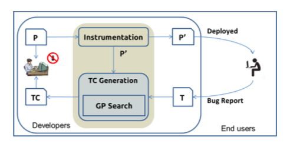

##**Reading Assignment 6: Summary**

####**i. Reference**

**Fitsum Meshesha Kifetew, Wei Jin, Roberto Tiella, Alessandro Orso, Paolo Tonella. ASE 2013. SBFR: A Search Based Approach for Reproducing Failures of Programs with Grammar Based Input**

**Link to the paper: ** [Paper] ( https://github.com/swaruparam/x9115swa/blob/master/hw/read/6/SBFR.pdf )

####**ii. Keywords**

**ii1. Field Failures** 
Field failures are the faults that occur on user machines due to an unexcepted edge case error after the deployment of the software code. It is a major concern for the modern software systems to duplicate the errors in-house and fixing it before the next release.

**ii2. Evolutionary Search**
This is an optimization heuristic where a population of candidate solutions is gathered and the future generations of similar candidates are obtained by reproduction of the previous generation candidates. Mechanisms by which reproduction may say to occur can be by means of mutation and crossover. Genetic Algorithm (GA) and Genetic Programming (GP) are two examples of such search algorithms. 

**ii3. Grammatical Evolution**
Grammatical Evolution is a type of Grammar Guided Genetic Programming (GGGP) where the individual candidates are sentences, which are formed by following the accepted rules of grammar. GE follows the Context Free Grammar (CFG), which is maintained at all times during mutation or crossover. Following the given steps for this particular grammar can produce the initial candidate set.

**ii4. Genotype - Phenotype**
Genotype - Phenotype is a pair used to represent an individual in GE. Genotype is the encoded form of a candidate that can be involved as such in the search algorithm, while phenotype is the executable version of the candidate which is predominantly used as an input for software under test. The mapping between these two values is used to convert the linear representation into a syntax tree.

####**iii. Brief Notes**

**iii1. Motivational Statements**

More often than not, there arise field failures even after thorough testing of a software and deployment into the market. This requires in-house bug fixing which involves duplication of the same experienced failure. Since software code can be very complex and there may be numerous paths or cases to a result, it becomes difficult to navigate through the code in the same manner to produce the desired error. Additionally, the problem faced is usually given as a grammatical input to the software engineers, which does not always provide complete information. Thus, the authors of the paper have proposed a model, Search Based Failure Reproduction (SBFR), to predict the trajectory of function calls or a list of operations that can be performed in order to obtain an analogous error to the one reported. This is performed by means of having the software code, input grammatical description of the fault and sample execution data.

**iii2. Hypotheses**

Since the input to the model is provided as a grammatical sentence, it needs to broken down to a tree of genotype-phenotype pairs in order to make it representable to the machine/program. This is performed by scanning through the input and picking out the words and operations, as per the selected grammar. The linear grammar representations can be encoded as a sequence of integers, called codons. Once the input has been made representable, the evolution operators of mutation and crossover are decided. Sub-tree crossover and mutation is frequently used to populate generations of suitable candidates. On passing these generated inputs to the SBFR model, it would yield results in the form of a list of operations which when carried out in order would give rise to a similar failure in the software under test. Being more efficient in computation and ease of operation, field failures should not be a huge concern using this predictive model.

**iii3. New Results**

Given an input program P, an execution E that results in failure F and set of execution data D, the model predicts an execution E' that results in a failure F' which is analogous to F. E' also generates the same data D to ensure that the failure occurs in the same manner. E' should also be an actual execution of P and should result in F' without any other additional information. This is illustrated in the diagram below.

Software Under Test (SUT) is the program P and the result E' obtained is a trajectory that depicts the order of function calls. SBFR uses 80/20 rule, where a probability of 0.2 is distributed normally over the recursive productions and the remaining 0.8 on non-recursive productions. The best solution is found by means of fitness functions, which are applied to the candidate solution to obtain a performance metric. The solutions are then ranked based on this score to obtain the best solution as the output of the model. 

**iii4. Related Work**

<ul>
<li> W. Jin and A. Orso, “Bugredux: Reproducing field failures for in-house debugging,” in Proc. of the 34th International Conference on Software
Engineering (ICSE), 2012, pp. 474–484. - BugRedux is a general approach for synthesizing, in-house, executions that observed field failures. </li> 

<li> J. Ro ̈ßler, A. Zeller, G. Fraser, C. Zamfir, and G. Candea, “Recon- structing Core Dumps,” in Proc. of the 6th International Conference on Software Testing, 2013, pp. 114–123. - RECORE applies genetic algorithms to synthesize executions from crash call stacks, but focuses on partial executions which does not guarantee that the approach would be able to reproduce complete executions. </li> 

<li> C. Zamfir and G. Candea, “Execution Synthesis: A Technique for Automated Software Debugging,” in Proceedings of the 5th European Conference on Computer Systems, 2010, pp. 321–334. - Specifically focus on reproducing concurrency-related failures.  </li>

</ul>

####**iv. Suggested Improvements**

<ul>
<li> The model can be made more efficient by improving the fitness functions to increase the probability of failure reproduction. This would in turn reduce the amount of time taken to obtain the final output. </li>

<li> The grammar used for the representation of inputs can be better learned to improvise on the initial input from which further processing is performed to yield generations of candidate solutions. </li>

<li> Current SBFR model can be extended to cater to complex programs such that the failure scenario can be replicated as efficiently as for the simple code programs. Since complicated software would give rise to more execution data and cases, the model should be accurate such that the trajectory of function calls does yield an analogous failure. </li>

</ul>

