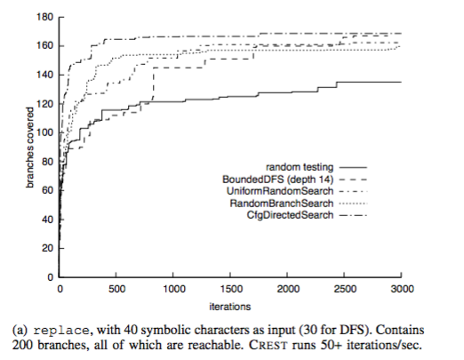
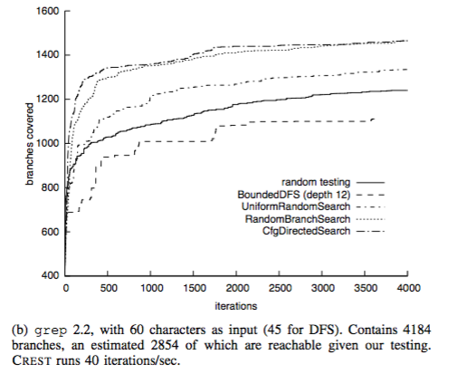
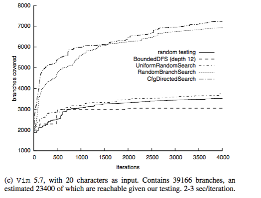

##**Reading Assignment 7: Summary**

####**i. Reference**

**Jacob Burnim, Koushik Sen. ASE 2008. Heuristics for Scalable Dynamic Test Generation**

**Link to the paper: ** [Paper] ( https://github.com/swaruparam/x9115swa/blob/master/hw/read/7/Heuristics%20for%20Scalable%20Dynamic%20Test%20Generation.pdf )

####**ii. Keywords**

**ii1. Concolic Testing**
Concolic testing is a phenomenon where software verification technique and concrete execution are used to obtain the symbolic execution of code and execution paths of a program. It is used as static, along with an automated portion of code, to generate test cases for the presence of bugs within a framework.

**ii2. Depth-first search strategy** 
The depth-first search over an algorithm yields an implicit tree of possible execution paths. Since the program may have a large number of possible execution paths, common testing data is bounded such that the search is performed within a limited area and is depth-limited.

**ii3. Random Testing**
Simple technique used in automated test generations, which run on randomly generated inputs and operates in negligible time. However, it does not provide the guarantee that all possible behaviors of a program would be tested.

**ii4. Control Flow Graph**
This depicts the static structure of the program that is being tested, in the form of branches showing path executions. The optimal testing would maximize the branch coverage, in order to ensure that all cases of the program are accounted for. Control flow graph directed search enables this by using a greedy approach on the generated CFG to achieve greater final coverage.

####**iii. Brief Notes**

**iii1. Motivational Statements**

Test case generation is an important element of development, where the developed framework is searched extensively for bugs. This can be automated using multiple existing features, which each use different search algorithm and operate on the inputs in a different manner. Although symbolic and concolic techniques have been effective in achieving this for small programs, they fail to function fast and effectively in larger programs. In these cases, only a tiny fraction of the total number of possible program paths is covered, thereby yielding less accurate results. The authors of the paper have implemented a couple of search algorithms that would cover a significant portion of the branches in a test program fast, using limited amount of space.

**iii2. Hypotheses**

The search algorithms developed are CFG - directed search, uniform random testing and bounded depth-first search. In the first algorithm, a static structure of the program is plotted with all possible branches denoting execution paths. These branches are chosen to negate the purpose of test generation based on the distance in CFG to the uncovered branches. This greedy approach ensures that the coverage area is maximized so that the search can be performed faster and more efficiently. In the second algorithm, the program space is sampled uniformly of all possible program paths and then performed the traditional random search. This controls the randomness of the technique, resulting in favorable outcomes. The last algorithm limits the number of branches travelled to an optimal depth such that maximum coverage is obtained from minimal space.

**iii3. New Results**

The implemented search algorithms, written in CREST (a prototype test generation tool for C), are compared against a sample test program Replace, GNU Grep 2.2 and Vim 5.7.

* Replace. This program consists of 600 lines with multiple program flow decisions. It is run with the implemented search algorithm with 10-symbolic-character suite and destination patterns ( 5 for bounded DFS) and 20-symbolic-character line of test open for substitution. The figure below shows that limited amount of testing covered 80% of all branches within a minute and with a little more testing, 85% or even 90% is achieved.

 

* GNU Grep 2.2. The GNU grep holds around 15000 lines of code and is run with 20-symbolic-character suite and destination patterns (5 for bounded DFS) and 40-symbolic-character line of test open for substitution. In only a couple of minutes, the most effective strategies cover almost 60% of the estimated reachable branches. CFG - directed search and the random branch search prove to perform better by a significant margin. This is highlighted in the figure below.

 

* Vim 5.7. This is a 150,000-line open source text editor. Provided a 40-symbolic-character input, most modules of the program are being reached and tested except certain parts such as the Ex mode. In 2-3 hours of testing, most effective strategies cover 1/3 of the total predicted branches and it can be seen that CFG-directed search and random branch search perform better than the others, similar the case before. They are faster and obtain better coverage, as depicted in the figure below.

 

**iii4. Related Work**

<ul>
<li> D. Bird and C. Munoz, “Automatic Generation of Random Self-Checking Test Cases,” IBM Systems Journal, vol. 22, no. 3, pp. 229–245, 1983. - Introduces the random search technique to automatically generate test cases for programs. </li> 

<li> J.C.King, “Symbolic Execution and Program Testing,” Communications of the ACM, vol. 19, no. 7, pp. 385–394, 1976. - Symbolic techniques for automated test generation, attempting to symbolically execute a program under test along all possible program paths, generating and solving constraints to produce concrete inputs that test each path.  </li> 

<li> P. Godefroid, N. Klarlund, and K. Sen, “DART: Directed automated random testing,” in Proc. of the ACM SIGPLAN 2005 Conference on
Programming Language Design and Implementation (PLDI), 2005. - Simultaneous symbolic execution with concrete executions.  </li>
</ul>

####**iv. Suggested Improvements**

<ul>
<li> The implemented models do not account for the complexities of each program under test. It only refers to the number of lines of code. Future work can be done on this regard to obtain experimental values for different code complexities and trying to make the algorithms more efficient based on it.  </li>

<li> Improvements can be made on the search algorithms such that the programs with larger number of lines can be initially stripped off the redundant code parts to obtain the crux or main operations. This would result in a faster run and test cases can be obtained faster, yet in an accurate manner. </li>

</ul>

