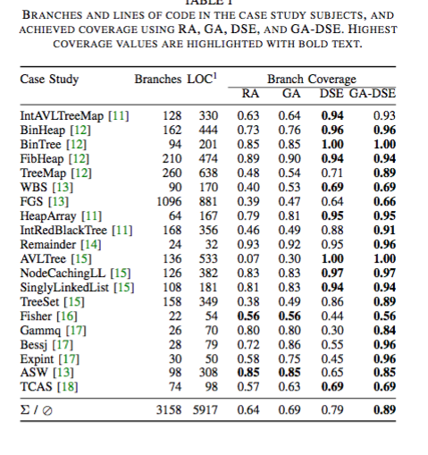

##**Reading Assignment 8: Summary**

####**i. Reference**

**Jan Malburg and Gordon Fraser. ASE 2011. Combining Search-based and Constraint-based Testing.**

**Link to the paper: ** [Paper] ( https://github.com/swaruparam/x9115swa/blob/master/hw/read/8/Combining%20Search-based%20and%20Constraint-based%20Testing.pdf )

####**ii. Keywords**

**ii1. Search-based methods**
These are used to scan through the program for all possible cases or scenarios and develop test cases to verify the functioning of them all. Search-based methods are efficient but often get stuck within local optima and degrade when the landscape does not offer guidance. 

**ii2. Constraint-based methods** 
These constitute the other type of methodology used to generate test cases from a program. The drawback of these methods is that, they are capable of handling only a subset of the domains and is not entirely scalable.

**ii3. Genetic Algorithm**
Genetic algorithms (GAs) evolve a population of candidate solutions, guided by a fitness function, towards achieving a given coverage criterion. They avoid from the search getting stuck by mutations and crossovers. They operate fast and provide large coverage.

**ii4. White-box testing**
It refers to the task of generating suitable inputs for programs using the program’s source code.

####**iii. Brief Notes**

**iii1. Motivational Statements**

There are predominantly two types of testing, which can be used to obtain the automatically generated test cases for a program, namely, search-based testing and constrain-based testing. Though each of these methods work effectively and produce reasonable results, they have a number of drawbacks. In the case of search-based testing, efficient algorithms are applied to find inputs that can best serve as suitable tests. Though this can handle any code and scales well, it depends largely on the type of guidance provided by the program landscape. If a flat program or a program with multiple local minima/maxima is given, this method fails to work as effectively. In the case of constraint-based testing, static and symbolic execution is used to precisely calculate the inputs. Though it accounts for search dependent on heuristics, it does not prove to be scalable and depends on the type of constraints set. Thus, the authors of the paper put forward the idea of combining both methods, exploiting the advantages of both, to yield a hybrid search GA.

**iii2. Hypothesis**

An initial population of candidate solutions is to be generated randomly for the program under test, using both search methods. Individuals are then crossed over with a certain probability and mutated using standard mutation operators. The path conditions for the considered individual are collected using DSE, following which a condition is selected randomly. A new constraint system is created, consisting of the path conditions that lead to the selected branch, conjoined with the negation of the selected path condition. This constraint set is passed to a constraint solver, and a solution to the constraint system represents a mutated individual that follows a different execution path than the original individual. If the constraint solver fails to find a satisfying assignment, then standard mutation is used as fallback. After determining the fitness values of the new population, the GA continues iterating until either a solution has been found or some other stopping condition is met. This overcomes the individual problems of search-based testing and constraint-based testing and proves to be more efficient than either of them alone.

**iii3. New Results**

Running GA-DSE, GA, DSE, did testing of the proposed hybrid model and random search on each of a set of 20 case study subjects as listed in the table below. For GA-DSE, the probability for choosing traditional vs. the new mutation operator was set to 50%. The examples consist mainly of linear constraints; Gammq, Fisher, Bessj, Expint, and ASW have constraints involving floating point numbers, as well as some non-linear constraints involving a square root, logarithm, bit-operations, and a quadratic function. 50,000 test executions were performed for each of the algorithms. The superiority of GA-DSE over random search and the GA is striking, with GA-DSE achieving higher coverage on all examples but Fisher and ASW, where it achieves the same coverage. Compared to DSE, for nine out of the 20 examples GA-DSE achieves significantly higher coverage. For the remaining 11 examples, both DSE and GA-DSE achieve the same coverage. For AVLTree and BinTree both achieve 100% coverage, and for the remaining nine examples it seems that both algorithms cover all feasible branches. On the whole, this confirms the authors' expectation that by combining GA with DSE in the GA-DSE algorithm one achieves significantly higher coverage than its constituents GA and DSE as well as random testing. 

**iii4. Related Work**

<ul>
<li> K.InkumsahandT.Xie,“Improving structural testing of object-oriented programs via integrating evolutionary testing and symbolic execution,” in Proceedings of the 2008 23rd IEEE/ACM International Conference on Automated Software Engineering (ASE’08). Washington, DC, USA: IEEE Computer Society, 2008, pp. 297–306. - Explains a combination of existing evolutionary testing tool with DSE tool, but neither of the techniques it is refined, and the combination is serial and not alternating like GA-DSE. </li> 

<li> K. Lakhotia, N. Tillmann, M. Harman, and J. de Halleux, “FloPSy - search-based floating point constraint solving for symbolic execution,” in 22nd IFIP International Conference on Testing Software and Systems, ser. Lecture Notes in Computer Science. Springer Berlin / Heidelberg, 2010, pp. 142–157. - Introduces FloPSy, an extension of the DSE tool PEX to use a search-based approach to solve floating-point constraints.  </li> 

<li> R. Majumdar and K. Sen, “Hybrid concolic testing,” in Proceedings of the 29th International Conference on Software Engineering (ICSE’07). Washington, DC, USA: IEEE Computer Society, 2007, pp. 416–426. - Interleaves DSE with random search, where DSE is used to provide an exhaustive local search, while random search is used to address the state problem and explore more diverse parts of the state space.  </li>
</ul>

####**iv. Suggested Improvements**

<ul>
<li> The selected population size for conducting this experiments is limited to 20 case studies. This can be further extended to operate on more cases to show the efficient of GA-DSE on a better scale. </li>

<li> The constraints within the constrain-based testing approach could be chosen in a more careful manner, instead of randomly assigning, to better the entire approach and increase the coverage. </li>

</ul>

